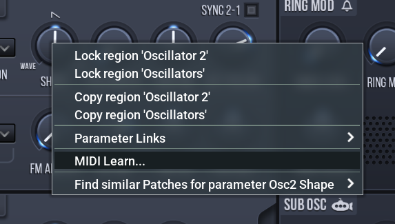
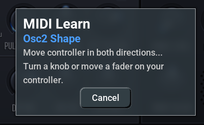
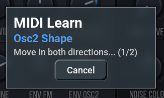
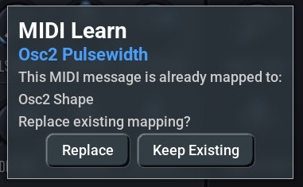
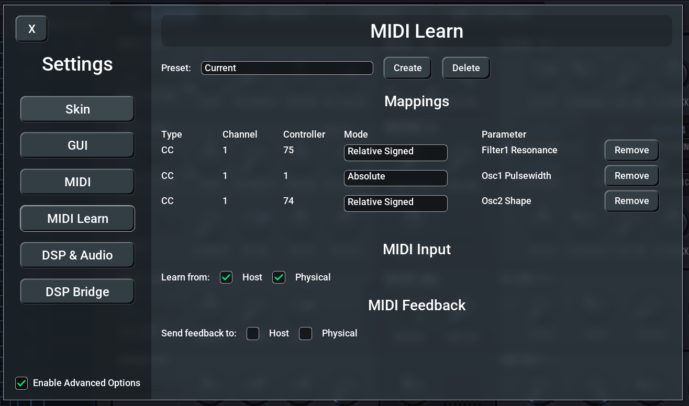
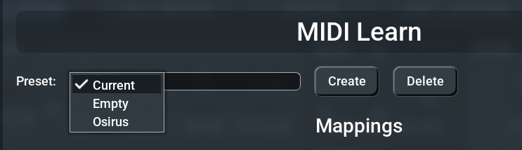
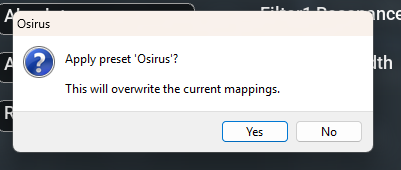
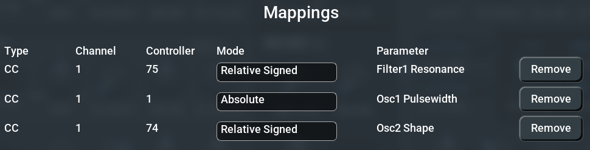
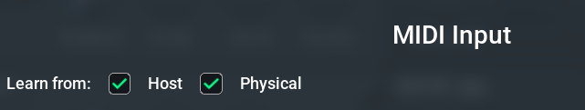
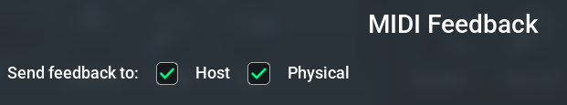

# MIDI Learn

## Introduction

MIDI Learn allows you to map any physical MIDI controller — knobs, faders, pitch wheels, aftertouch — directly to any parameter in the synthesizer. Instead of relying on the fixed MIDI CC mappings built into the original firmware, you can create your own custom mappings that match your specific hardware setup.

This is especially useful when using external MIDI controllers that don't follow the synth's default CC assignments, or when you want quick access to parameters that aren't normally available via MIDI.

Key features:
- **Automatic detection** — Simply move a controller and the plugin figures out the MIDI message type and mode
- **Multiple MIDI types** — Supports Control Change (CC), Pitch Bend, Channel Pressure (Aftertouch), and Poly Pressure
- **Relative encoder support** — Two relative modes for endless rotary encoders
- **Preset management** — Save and recall different controller mappings for different hardware setups
- **MIDI feedback** — Send parameter values back to your controller for motorized faders or LED rings
- **Input source filtering** — Choose whether to learn from the DAW host, physical MIDI ports, or both

## Quick Start

1. **Right-click** on any parameter (knob, slider, button) in the plugin UI
2. Select **"MIDI Learn..."** from the context menu
3. **Move** the controller you want to assign (turn a knob, move a fader)
4. The mapping is created automatically

That's it! The parameter now responds to your MIDI controller.

## Learning a New Mapping

### Opening the Learn Dialog

Right-click on any parameter in the plugin interface to open the context menu, then select **"MIDI Learn..."**.

### The Learning Dialog

A dialog appears showing the parameter name and a status message:

> *Move controller in both directions...*
> *Turn a knob or move a fader on your controller.*

Move your MIDI controller — the dialog shows progress as it collects MIDI data. You need to send at least **two different values** (e.g., turn a knob both left and right) so the plugin can determine whether you're using an absolute or relative controller.

Once enough data is collected, the dialog closes automatically and the mapping is active immediately.

### Supported MIDI Message Types

The learning dialog automatically detects the type of MIDI message you send:

| Type | Description | Example |
|------|-------------|---------|
| **CC** (Control Change) | Standard continuous controller | Knobs, faders, buttons |
| **Pitch Bend** | Pitch wheel messages | Pitch wheel, joystick |
| **Channel Pressure** | Channel aftertouch | Keyboard aftertouch (mono) |
| **Poly Pressure** | Polyphonic key pressure | Per-key aftertouch |

### Automatic Mode Detection

For Control Change messages, the plugin automatically detects whether your controller sends absolute or relative values:

| Mode | Values | Use Case |
|------|--------|----------|
| **Absolute** | 0–127 linear | Standard knobs and faders |
| **Relative Signed** | 1 = increment, 127 = decrement | Endless encoders (signed mode) |
| **Relative Offset** | 65 = increment, 63 = decrement | Endless encoders (offset mode) |

Pitch Bend, Channel Pressure, and Poly Pressure are always mapped as **Absolute**.

### Conflict Resolution

If the MIDI controller you're assigning is already mapped to a different parameter, a conflict dialog appears:

> *This MIDI message is already mapped to:*
> ***[existing parameter name]***
> *Replace existing mapping?*

You have two options:
- **Replace** — Remove the old mapping and create the new one
- **Keep Existing** — Cancel and leave the current mapping in place

## Settings Page

Open the Settings dialog by pressing **Escape** or by right-clicking anywhere on the plugin UI and selecting **"Settings..."** from the context menu. Then navigate to the **MIDI Learn** page.

### Preset Management

At the top of the MIDI Learn settings page, you'll find the preset controls:

- **Preset dropdown** — Select a preset to preview or the **"Current"** entry for the active mappings
- **Create** — Save the current mappings as a new named preset
- **Delete** — Remove the selected preset (cannot delete "Current")
- **Apply** — Commit a previewed preset (only visible when a saved preset is selected)

#### The "Current" Preset

The **"Current"** entry always represents the mappings that are currently active in the plugin. When you learn new mappings or modify existing ones, they are reflected here.

#### Creating a Preset

1. Click **Create**
2. Type a name for the preset
3. Press Enter — the current mappings are saved under that name

The new preset is a copy of whatever mappings are currently active.

#### Previewing and Applying a Preset

When you select a saved preset from the dropdown, it is loaded as a **preview**. You can play and test whether the mappings work with your current setup. However, if you close the Settings dialog without pressing **Apply**, the previous mappings are restored.

To permanently switch to the preset:
1. Select the preset from the dropdown
2. Test it
3. Click **Apply**
4. Confirm the dialog — the preset becomes the new active mapping

#### Deleting a Preset

Select the preset you want to remove, then click **Delete**. A confirmation dialog appears. The "Current" entry cannot be deleted.

### Mappings Table

The mappings table shows all active MIDI-to-parameter assignments:

| Column | Description |
|--------|-------------|
| **Type** | MIDI message type (CC, Pitch Bend, Chan Press, Poly Press) |
| **Channel** | MIDI channel (1–16) |
| **Controller** | CC number or note number (shown as "-" for Pitch Bend and Channel Pressure) |
| **Mode** | Absolute, Relative Signed, or Relative Offset (dropdown, editable) |
| **Parameter** | Target parameter name |
| **Remove** | Delete this individual mapping |

You can change the **Mode** of any mapping directly in the table by clicking the dropdown. This is useful if the auto-detection picked the wrong mode for your controller.

### MIDI Input

The **MIDI Input** section controls which MIDI sources are used for both learning and playback:

- **Host** — MIDI messages routed through the DAW (e.g., from a MIDI track)
- **Physical** — MIDI messages from directly connected hardware controllers

Enable one or both depending on your setup. If both are disabled, MIDI Learn will not receive any input.

### MIDI Feedback

The **MIDI Feedback** section controls where parameter value updates are sent back as MIDI messages:

- **Host** — Send feedback to the DAW (useful for controller LED ring sync via the host)
- **Physical** — Send feedback directly to hardware controllers (for motorized faders or LED rings)

Feedback always sends **absolute** values, even for parameters mapped in relative mode. Feedback is only sent for changes originating from the plugin UI or automation — not for incoming MIDI (to avoid feedback loops).

## Tips

- **Multiple mappings per parameter** — You can map the same parameter to multiple MIDI controllers
- **One controller, one parameter** — Each MIDI controller (same type + channel + CC number) can only control one parameter at a time
- **Encoder detection** — If your encoder isn't detected correctly, you can manually change the mode in the mappings table
- **Preset portability** — Presets are saved as JSON files in the plugin's configuration directory and can be shared between instances
